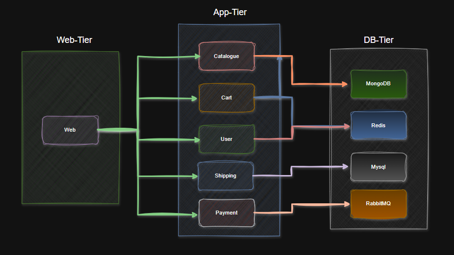

# Microservices Deployment with Docker and Docker Compose

**Communication between components**



This document outlines the deployment process for a microservices-based application using Docker and Docker Compose. The application consists of several services, databases, and a custom network for seamless interconnectivity.

---

## Application Services
1. **Frontend (Web)**
   - Frontend service using Nginx with a custom configuration file.

2. **Backend Services**
   - **Catalogue**
   - **Cart**
   - **User**
   - **Shipping**
   - **Payments**

---

## Databases
1. **MySQL** (Custom Dockerfile for deployment)
2. **MongoDB** (Custom Dockerfile for deployment)
3. **Redis** (Pulled from Docker Hub)
4. **RabbitMQ** (Pulled from Docker Hub)

---

## Deployment Workflow
### 1. Building Images
Each service has its own Dockerfile. Images are built using the following steps:
- Navigate to the service directory.
- Run the command to build the Docker image:
  ```bash
  docker build -t <service_name> .
  ```

Repeat this step for all services, including custom database images for MySQL and MongoDB.

### 2. Setting Up the Network
Create a Docker network named `robokart` to connect all the services:
```bash
docker network create robokart
```

### 3. Docker Compose Configuration
A `docker-compose.yml` file is used to manage and deploy all the services and databases. The file ensures that:
- Containers are run from pre-built images.
- Persistent volumes are created for databases (MySQL, MongoDB, Redis, RabbitMQ).
- Services are interconnected via the `robokart` network.

### 4. Running the Application
Run the application using Docker Compose:
```bash
docker-compose up -d
```

This command:
- Starts all the services as containers.
- Ensures database persistence with volumes.

---

## Persistence Volumes
### Databases with Persistence:
1. **MySQL**: Data volume to persist database files.
2. **MongoDB**: Data volume to persist MongoDB collections.
3. **Redis**: Data volume to persist cache data.
4. **RabbitMQ**: Data volume to persist message queues.

---

## Additional Information
- **Nginx Configuration**: The web service uses a custom Nginx configuration file to route traffic to backend services.
- **Networking**: All services communicate within the `robokart` Docker network.
- **Scaling**: Individual services can be scaled by modifying the `docker-compose.yml` file and running:
  ```bash
  docker-compose up --scale <service_name>=<replica_count>
  ```

---

## Commands Reference
### Building Images
```bash
docker build -t <service_name> .
```
``Note``: service_name must be same to serice name , should not give any additional names and prodie version tag like 1.0, if you want to update, need to make sure in compose file as well.

```example```: 
```bash
docker build -t catalogue:1.0 .
docker build -t mysql:1.0 .
docker build -t web:1.0 .
docker build -t payment:1.0 .
```

### Creating a Network
```bash
docker network create robokart
```

### Running Services with Docker Compose
```bash
docker-compose up -d
```

### Stopping Services
```bash
docker-compose down
```

---


