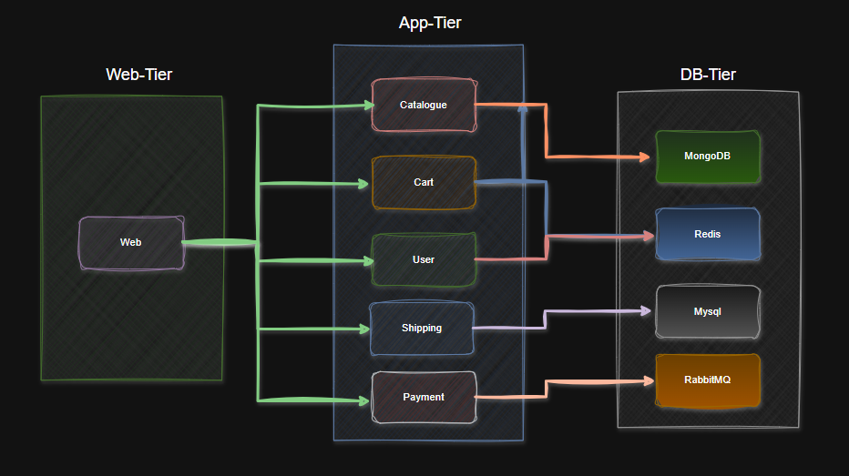

This project demonstrates the deployment of a complete e-commerce system called Robokart. The system includes various frontend, backend, and database components, with a focus on scalability, maintainability, and security.

**Communication between components**

Project Components
1. Frontend
    
    - Web
2. Backend

    - Catalogue
    - Cart
    - User
    - Shipping
    - Payment
3. Database
    - MongoDB
    - MySQL
    - Redis
    - RabbitMQ

Source: https://github.com/instana/robot-shop